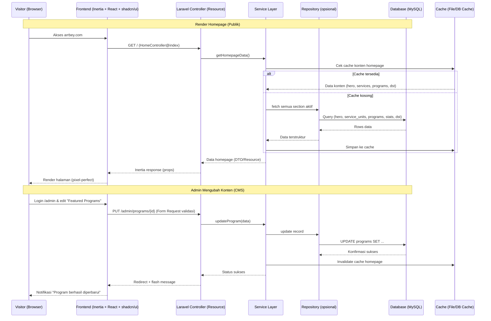

# PRD — Project Requirements Document
# Website Company Profile "Arrbey.com" (CMS/Dinamis)

## 1. Overview
Arrbey adalah sebuah ekosistem terintegrasi untuk business learning, research, consulting, dan growth support, yang menaungi 7 unit layanan (Arrbey X, Sekolah Ekspor, Sekolah Pangan, Sekolah Koperasi, MSA, CSA, BMA). Website ini bertujuan menjadi **wajah digital utama Arrbey** — menampilkan value proposition, unit-unit layanan, program unggulan, dan menjadi entry point bagi calon partner/klien untuk menghubungi tim Arrbey.

Masalah utama yang ingin diselesaikan:
- Konten company profile (hero, layanan, program, statistik, dsb) saat ini bersifat statis/manual sehingga sulit diperbarui oleh tim non-teknis.
- Dibutuhkan sebuah **CMS ringan** agar Admin dapat mengubah teks, gambar, tautan, dan urutan konten tanpa perlu menyentuh kode.
- Website harus mudah di-deploy dan dirawat di **shared hosting (cPanel)** dengan MySQL, tanpa memerlukan konfigurasi server khusus (bukan VPS/Docker).

Tujuan utama aplikasi adalah membangun **website company profile yang pixel-perfect** sesuai desain referensi, dengan **Admin Dashboard (CMS)** yang memungkinkan pengelolaan seluruh section homepage (hero, service bar, 7 service units, statistik, "for whom we serve", featured programs, CTA, footer) secara dinamis, dibangun di atas **Laravel 12 + PHP 8.2 + shadcn/ui + MySQL**, siap dipasang di shared hosting.

## 2. Requirements
Persyaratan tingkat tinggi untuk pengembangan sistem:

- **Aksesibilitas:** Website publik dapat diakses via browser desktop & mobile (fully responsive). Admin dashboard diakses via desktop/laptop.
- **Pengguna:**
  - **Visitor/Publik:** Melihat seluruh halaman publik tanpa login.
  - **Admin:** 1 role penuh (superadmin) yang mengelola seluruh konten CMS, bisa dikembangkan multi-role di masa depan (opsional, tidak wajib MVP).
- **CMS/Dinamis:** Semua section pada homepage (hero, 4-icon service bar, 7 service units, list "We Help Businesses", statistik counter, "For Whom We Serve", 6 featured programs, CTA banner, footer & menu navigasi) harus **dapat diedit lewat dashboard**, termasuk teks, gambar/icon, urutan (order/drag-sort), dan status tampil/sembunyikan (toggle active).
- **Media Management:** Upload gambar dilakukan lewat form admin, tersimpan di `storage/app/public`, dioptimasi ukuran (resize/compress) agar tidak membebani shared hosting.
- **Database:** MySQL (kompatibel XAMPP untuk local development, dan cPanel MySQL untuk production).
- **Deployment:** Harus bisa di-deploy ke shared hosting cPanel standar (tanpa root access, tanpa Docker, tanpa Node.js runtime di server — build asset dilakukan lokal/CI lalu di-upload hasil build-nya).
- **Stack Frontend:** shadcn/ui (berbasis React + Tailwind) diintegrasikan ke Laravel 12 menggunakan **Inertia.js**, sehingga tetap satu codebase Laravel namun UI menggunakan komponen shadcn/ui yang reusable & pixel-perfect.
- **Maintainability:** Kode harus modular, mengikuti Clean Architecture ringan (Controller → Service → Repository opsional → Model), agar mudah dirawat developer lain di kemudian hari.

## 3. Core Features
Fitur-fitur kunci yang harus ada dalam versi pertama (MVP), dipetakan langsung dari desain referensi:

1. **Landing Page (Homepage) — Publik**
   - **Navbar:** Logo Arrbey X, menu (Home, About Us, Our Services, Programs, Insights, Partners, Contact), tombol CTA "Let's Talk" — seluruhnya dikelola dari CMS Menu.
   - **Hero Section:** Judul besar "GROW WITH DIRECTION", tagline, deskripsi paragraf, 2 tombol CTA ("Explore Arrbey Services", "Contact Arrbey"), background image (globe + pelabuhan).
   - **Service Highlight Bar:** 4 item ikon + judul + deskripsi singkat (Research & Insights, Learning & Training, Consulting & Advisory, Mentoring & Execution).
   - **Our 7 Service Units:** Grid 7 card (Arrbey X, Sekolah Ekspor, Sekolah Pangan, Sekolah Koperasi, MSA, CSA, BMA) masing-masing punya logo/nama, subjudul, deskripsi, tautan "Learn More" (link ke halaman detail unit — opsional MVP: link eksternal/anchor).
   - **"We Help Businesses Grow in Many Ways":** Judul + list checklist (8 poin) yang dapat ditambah/kurangi dari CMS.
   - **Statistik Counter:** 4 angka pencapaian (10.000+ Growth Partners, 500+ Training & Programs, 25+ Countries Reached, 100+ Experts & Mentors).
   - **"For Whom We Serve":** Panel gelap berisi 7 kategori audiens dengan ikon + label.
   - **Featured Programs:** Grid 6 card program (gambar, judul, deskripsi, "Learn More"), masing-masing dapat diatur urutannya.
   - **CTA Banner:** "Ready to Grow with Direction?" + 2 tombol ("Start with Arrbey", "Discuss Your Needs").
   - **Footer:** Logo & deskripsi singkat, social media icons, 4 kolom tautan (Company, Our Services, Resources, Get in Touch), peta dunia dekoratif, copyright bar (Privacy Policy, Terms of Use).

2. **Admin Dashboard (CMS)**
   - **Login Admin:** Autentikasi email & password (Laravel Breeze/Fortify base, disesuaikan shadcn/ui).
   - **Manajemen Hero Section:** Edit judul, tagline, deskripsi, gambar background, teks & link tombol.
   - **Manajemen Service Bar (4 item):** CRUD ikon, judul, deskripsi.
   - **Manajemen 7 Service Units:** CRUD card (nama, subjudul, deskripsi, warna aksen, link, urutan, status aktif).
   - **Manajemen List "We Help Businesses":** CRUD item checklist + urutan.
   - **Manajemen Statistik:** Edit angka & label 4 statistik.
   - **Manajemen "For Whom We Serve":** CRUD 7 kategori (ikon + label).
   - **Manajemen Featured Programs:** CRUD program (gambar, judul, deskripsi, link, urutan, status aktif).
   - **Manajemen CTA Banner:** Edit judul, subjudul, teks & link 2 tombol.
   - **Manajemen Menu Navigasi & Footer:** CRUD menu utama, kolom footer, social media link.
   - **Manajemen Media/Gambar:** Upload, preview, hapus gambar terpusat (media library sederhana).
   - **Pengaturan Umum (Settings):** Logo, favicon, alamat kantor, email, nomor telepon, meta SEO default.

3. **Halaman Statis Pendukung (opsional MVP, disiapkan strukturnya)**
   - Halaman "About Us", "Contact", dan halaman detail per Service Unit/Program dapat mengikuti pola CMS yang sama (page builder sederhana) — dikembangkan di fase berikutnya dengan struktur tabel yang sudah disiapkan (`pages`).

## 4. User Flow

### 4.1 Alur Visitor (Publik)
1. **Landing:** Visitor membuka arrbey.com, melihat Hero Section dan CTA utama.
2. **Eksplorasi Layanan:** Visitor scroll ke "Our 7 Service Units", klik salah satu "Learn More" untuk mempelajari unit tertentu.
3. **Eksplorasi Program:** Visitor melihat "Featured Programs", klik "Learn More" pada program yang diminati.
4. **Konversi:** Visitor klik tombol "Let's Talk" (navbar) atau "Start with Arrbey"/"Discuss Your Needs" (CTA banner) untuk menuju halaman/Form kontak.
5. **Navigasi Lanjutan:** Visitor dapat berpindah ke menu lain (About Us, Insights, Partners, Contact) melalui navbar atau footer.

### 4.2 Alur Admin (CMS)
1. **Login:** Admin masuk ke `/admin/login` menggunakan email & password.
2. **Dashboard:** Admin melihat ringkasan konten (jumlah service units, programs aktif, dsb).
3. **Edit Konten:** Admin memilih menu section (misal "Featured Programs"), melakukan tambah/edit/hapus/reorder data, upload gambar bila perlu.
4. **Preview & Publish:** Admin menyimpan perubahan; sistem melakukan validasi (Form Request), lalu langsung tampil di homepage publik (cache di-clear otomatis).
5. **Kelola Pengaturan:** Admin dapat memperbarui logo, kontak, dan meta SEO dari menu Settings.

## 5. Architecture
Gambaran arsitektur sistem dan aliran data (contoh: rendering homepage dari CMS, dan proses admin mengubah konten):

## 6. Database Schema

Entity Relationship Diagram (ERD) untuk struktur database utama (mendukung seluruh section homepage sebagai konten dinamis):

```mermaid
erDiagram
    users {
        int id PK
        string name
        string email
        string password_hash
        string role
        datetime created_at
    }

    site_settings {
        int id PK
        string key
        text value
        string type
        datetime updated_at
    }

    menus {
        int id PK
        string label
        string url
        string location
        int order
        boolean is_active
    }

    hero_sections {
        int id PK
        string title
        string subtitle
        text description
        string image_path
        string primary_btn_text
        string primary_btn_url
        string secondary_btn_text
        string secondary_btn_url
        boolean is_active
    }

    service_bar_items {
        int id PK
        string icon
        string title
        string description
        int order
        boolean is_active
    }

    service_units {
        int id PK
        string name
        string subtitle
        text description
        string logo_path
        string accent_color
        string link_url
        int order
        boolean is_active
    }

    growth_points {
        int id PK
        string label
        int order
        boolean is_active
    }

    stats {
        int id PK
        string value
        string label
        string icon
        int order
        boolean is_active
    }

    audience_categories {
        int id PK
        string icon
        string label
        int order
        boolean is_active
    }

    programs {
        int id PK
        string title
        text description
        string image_path
        string link_url
        int order
        boolean is_active
    }

    cta_banners {
        int id PK
        string title
        string subtitle
        string primary_btn_text
        string primary_btn_url
        string secondary_btn_text
        string secondary_btn_url
        boolean is_active
    }

    footer_columns {
        int id PK
        string title
        int order
    }

    footer_links {
        int id PK
        int footer_column_id FK
        string label
        string url
        int order
    }

    media {
        int id PK
        string file_name
        string file_path
        string mime_type
        int uploaded_by FK
        datetime created_at
    }

    pages {
        int id PK
        string title
        string slug
        text content
        string meta_title
        string meta_description
        boolean is_active
        datetime created_at
    }

    footer_columns ||--o{ footer_links : "has many"
    users ||--o{ media : "uploads"
    users ||--o{ pages : "authors"
```

| Tabel | Deskripsi |
|-------|-----------|
| **users** | Data admin/pengguna sistem dengan role akses |
| **site_settings** | Pengaturan umum (logo, favicon, kontak, meta SEO default) key-value |
| **menus** | Menu navbar & footer, dapat diatur lokasi dan urutannya |
| **hero_sections** | Konten Hero homepage (judul, deskripsi, gambar, tombol CTA) |
| **service_bar_items** | 4 item ikon layanan di bawah hero |
| **service_units** | 7 unit layanan Arrbey (Arrbey X, Sekolah Ekspor, dst) |
| **growth_points** | List checklist "We Help Businesses Grow in Many Ways" |
| **stats** | 4 angka statistik pencapaian |
| **audience_categories** | 7 kategori "For Whom We Serve" |
| **programs** | Featured Programs (6 card) |
| **cta_banners** | Konten CTA banner sebelum footer |
| **footer_columns / footer_links** | Struktur kolom & tautan footer |
| **media** | Media library terpusat untuk seluruh gambar CMS |
| **pages** | Halaman statis tambahan (About Us, Contact, dsb) untuk fase berikutnya |

## 7. Design & Technical Constraints

### 7.1 Tech Stack
- **Backend:** Laravel 12, PHP ^8.2 (kompatibel shared hosting umum yang mendukung PHP 8.2).
- **Frontend:** Inertia.js + React + **shadcn/ui** (Tailwind CSS) — asset di-build lokal/CI (`npm run build`) menghasilkan file statis, sehingga di server hosting cukup PHP tanpa perlu Node.js runtime.
- **Database:** MySQL 8/MariaDB (kompatibel XAMPP lokal & cPanel MySQL production).
- **Authentication:** Laravel Breeze/Fortify (disesuaikan tampilan shadcn/ui) untuk login Admin.
- **Storage:** Local filesystem (`storage/app/public` via symlink) — kompatibel shared hosting tanpa S3/cloud khusus.
- **Caching:** File cache/database cache (bukan Redis) agar tidak butuh service tambahan di shared hosting.

### 7.2 Coding Standard
- **Clean Architecture ringan:** Controller (tipis) → Service Layer (logic bisnis) → Repository (opsional, untuk abstraksi query) → Eloquent Model.
- **Service Layer:** Setiap fitur CMS memiliki Service class (misal `ProgramService`, `HeroSectionService`) yang menangani logic, dipanggil dari Controller.
- **Repository Pattern (opsional):** Digunakan pada entitas yang query-nya kompleks/reusable; untuk entitas CRUD sederhana boleh langsung via Model/Eloquent.
- **Form Request Validation:** Semua input admin (create/update) divalidasi lewat class `FormRequest` khusus (mis. `StoreProgramRequest`, `UpdateHeroSectionRequest`).
- **Resource Controller:** Mengikuti konvensi RESTful Laravel (`index, create, store, edit, update, destroy`) untuk setiap entitas CMS.
- **Reusable Components:** Komponen shadcn/ui (Card, Button, Table, Dialog, Form, dsb) dibuat reusable di `resources/js/components`, dipakai lintas halaman admin maupun publik.
- **Modular Folder Structure:** Pemisahan folder per domain (`app/Services`, `app/Repositories`, `app/Http/Requests`, `app/Http/Resources`, `resources/js/Pages/{Public,Admin}`, `resources/js/components/{ui,sections}`).

### 7.3 Standar Kualitas Proyek
- **Pixel Perfect:** ≥99% sesuai desain referensi (spacing, warna, tipografi, ukuran komponen).
- **Lighthouse Performance:** ≥95.
- **Lighthouse SEO:** ≥95 (meta tag dinamis dari `site_settings`/`pages`, sitemap.xml, robots.txt).
- **Lighthouse Accessibility:** ≥90 (kontras warna, alt text gambar, aria-label pada ikon interaktif).
- **Lighthouse Best Practices:** ≥95.
- **Fully Responsive:** Mendukung breakpoint mobile, tablet, dan desktop sesuai desain.
- **Cross Browser:** Teruji di Chrome, Edge, Safari, dan Firefox versi terbaru.
- **Minim Dependency:** Hanya menggunakan package yang benar-benar diperlukan; hindari library berat/duplikat fungsi.
- **Kemudahan Deployment:** Struktur build siap di-upload ke shared hosting cPanel (folder `public` sebagai document root, tanpa perlu akses SSH/Node.js di server, cukup PHP + MySQL + konfigurasi `.env`).

### 7.4 Typography & Visual Guidelines
Mengikuti desain referensi (warna utama teal/dark green `#0F3D3E`-ish untuk brand, aksen warna berbeda per Service Unit card):
- **Font utama:** Sans-serif modern (mis. Inter/Geist) untuk body & UI, bold untuk heading besar seperti "GROW WITH DIRECTION".
- **Warna:** Palet dark teal untuk navbar/footer/CTA, putih untuk section content, aksen warna per unit (biru MSA, kuning CSA, ungu BMA, dst) dapat dikonfigurasi lewat field `accent_color` di tabel `service_units`.
- **Iconography:** Ikon line-style (outline) konsisten pada service bar, "For Whom We Serve", dan card statistik.
